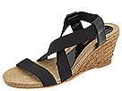

# Zappos dataset classifier
## Input


## Output
`Sandal`

[UT zappos dataset](http://vision.cs.utexas.edu/projects/finegrained/utzap50k/) has shoe images collected from Zappos.com. There are several types of labels on the dataset but the one we use in this study are the following classes in the dataset:

- Shoes
- Boots
- Sandals
- Slippers

We use VGG pretrained model and add a softmax to have a 4 neuron layer on the top. We finetune the dataset over 10 epochs, with the learning rate for the lower layers fixed to `1e-6` while the top linear layer is fixed to `1e-3` with weight decay. 


At the end of ten epochs, we have the following confusion matrix. `52.735%` for shoes is low but the zappos dataset has a lot of cross-pollination between boots, sandals, slippers and shoes so it is just an artifact of the dataset.
````
ConfusionMatrix:                                                                         
[[    1591     235     627     564]   52.735%   [class: 1]                              
 [     230     965      30      58]   75.214%   [class: 2]                               
 [      66       8     445      55]   77.526%   [class: 3]                               
 [      11       8      15      94]]  73.438%   [class: 4]                              
 + average row correct: 69.728121161461%                                              
 + average rowUcol correct (VOC measure): 39.540689624846%                              
 + global correct: 61.87524990004%                                                      
````
To predict for an image do:

````
~/zappos_classify$ th predict.lua -im ~/datasets/zappos/ut-zap50k-image
s/Sandals/Heel/Eric\ Michael/7655272.3.jpg
Finished loaded model
***********************************************
Predict: sandals
********* Details **********
Prediction time 0.16613912582397 seconds.
Classes: [shoes, boots, sandals, slippers]
-2.7951 -6.1849 -0.0861 -3.9458
[torch.CudaTensor of size 1x4]
````

## Requirements
Zappos dataset.

VGG models from modelzoo [here](https://github.com/torch/torch7/wiki/ModelZoo)

VGG input mean in torch format [here](https://www.dropbox.com/s/7nlajnouusadyx4/VGG_mean.t7?dl=0)

## Data/model setup
A bit unclean right now. Using a utility like `find`, place the files belonging to shoes into `"shoes.txt"`, those from sandals into `"sandals.txt"`, boots into `"boots.txt"` and slippers into `"slippers.txt"`. Start training. 

## Using existing model
Download trained model from [here](https://www.dropbox.com/s/6eep91ncsf4us6e/vggmodel.t7?dl=0) and input mean from [here](https://www.dropbox.com/s/7nlajnouusadyx4/VGG_mean.t7?dl=0). Use `predict.lua` to predict for an image.
